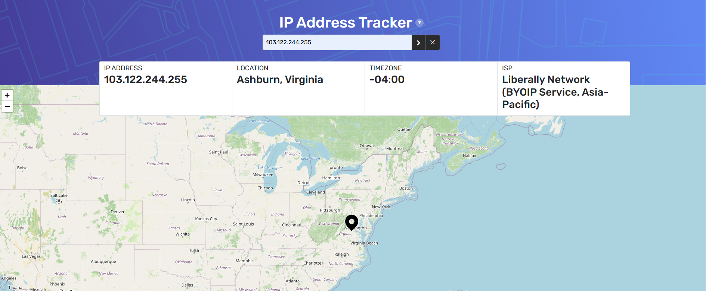

# IP Address Tracker

Aplicación web que permite buscar cualquier dirección IP y visualizar su geolocalización en un mapa interactivo, junto con detalles como ciudad, región, zona horaria e ISP.

## Vista previa

## Funcionalidades

- Búsqueda de cualquier dirección IPv4 para obtener su geolocalización
- Mapa interactivo que se centra automáticamente en la ubicación buscada
- Muestra IP, ciudad/región, zona horaria e ISP
- Animaciones de entrada con AOS (Animate On Scroll)
- Diseño responsivo para escritorio y móvil
- Indicador de carga mientras se obtienen los datos
- Alertas de error mediante modales

## Tecnologías utilizadas

| Categoría | Tecnología |
|---|---|
| Framework | React 18 |
| Build Tool | Vite + SWC |
| Peticiones HTTP | React Query + Axios |
| Mapas | React-Leaflet / Leaflet |
| UI | Bootstrap 5 + Reactstrap |
| Animaciones | AOS (Animate On Scroll) |
| Alertas | SweetAlert2 |

## API

Este proyecto utiliza la [IPify Geo API](https://geo.ipify.org/) para obtener la geolocalización de las direcciones IP.

**Endpoint:** `GET https://geo.ipify.org/api/v2/country,city`

**La respuesta incluye:**
- Dirección IP
- Ciudad, región y país
- Latitud / Longitud
- Zona horaria
- ISP (Proveedor de servicios de internet)

Los tiles del mapa son servidos por [OpenStreetMap](https://www.openstreetmap.org/) a través de Leaflet.
